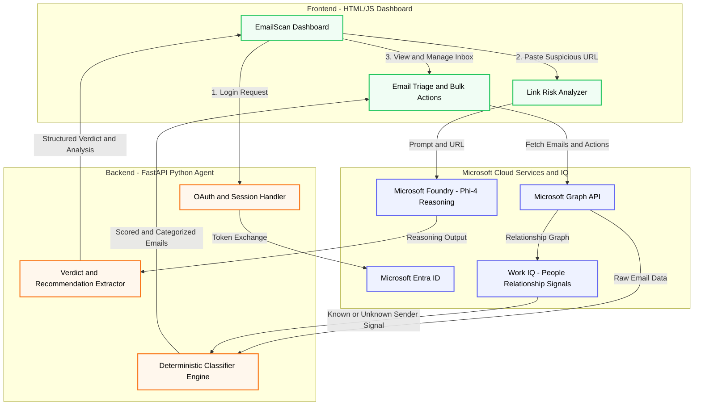

# 🛡️ EmailScan AI - Enterprise Security Agent

**Submission for the Microsoft Agents League Hackathon 2026**
**Tracks:** Reasoning Agents & Enterprise Agents

Over 90% of corporate cyberattacks originate from the email inbox. Standard spam filters rely on outdated blacklists and often miss highly targeted spear-phishing, zero-day lookalike domains, and high-urgency social engineering.

EmailScan AI is a localized proxy agent that connects securely via OAuth to a user's Microsoft Outlook account. It categorizes real-time risks into clean, actionable views, checks relationship histories, and isolates suspicious links using agentic, step-by-step reasoning, neutralizing threats before they are ever clicked.

## 🚀 Key Features & Microsoft IQ Integrations

This project heavily leverages Microsoft's intelligence layers to provide enterprise-grade security:

### Work IQ (Microsoft Graph API)

- **Relationship Graphing**: the backend uses the Graph API's `People.Read` relevance ranking to check whether an urgent sender is a known contact. A high-urgency email from someone with no relationship history is flagged as a risk, and a known contact suddenly sending phishing-style content is flagged as a possible account compromise.
- **Folder Placement Check**: cross references the classifier's verdict against where Outlook actually filed each email, surfacing risky emails Outlook left in the Inbox and legitimate-looking emails Outlook wrongly sent to Junk.
- **Seamless Remediation**: users can select emails and Report (move to Junk), Delete (move to Deleted Items, fully recoverable), or Unsubscribe (RFC 8058 one-click) directly through Graph API integrations. Unsubscribe is only ever offered for senders not flagged as Phishing Risk or Suspicious, since "unsubscribe" links in scam emails are not real and should never be acted on.

### Foundry IQ (Microsoft Foundry, Phi-4 Reasoning Agent)

- **Link Risk Analyzer**: rather than checking static blacklists, EmailScan AI extracts the full suspicious link from a flagged email's body, not just the truncated preview, and sends it to a Phi-4-reasoning deployment on Microsoft Foundry.
- **Step-by-Step Analysis**: the model reasons through domain structure, TLDs, brand impersonation, and hyphenation to produce a Safe / Suspicious / Phishing verdict and a one-line recommendation, without ever visiting the link itself.

## 🏗️ Architecture



## 📂 Project Structure

```
emailscan-ai/
│
├── backend/
│   ├── classifier.py       # Deterministic regex + Work IQ scoring engine
│   ├── main.py             # FastAPI server and Phi-4 integration
│   └── outlook_reader.py   # Microsoft Graph API OAuth & mailbox tools
│
├── ui/
│   └── index.html          # Single-page HTML/JS dashboard
│
├── .env                     # (ignored by git) API keys & endpoints
├── .gitignore               # Git ignore rules
└── README.md                # Project documentation
```

## ⚙️ Setup & Installation Guide (For Judges)

To run this project locally, you will need a Microsoft Azure account and Python 3.9+.

### 1. Clone the repository

```bash
git clone https://github.com/VikramAdityaTheKing/emailscan-ai.git
cd emailscan-ai
```

### 2. Install dependencies

```bash
pip install -r requirements.txt
```

### 3. Configure Microsoft Entra ID (Graph API)

1. Go to the Azure Portal and search for **App Registrations**.
2. Click **New Registration** (name it `EmailScan AI`).
3. Set the Redirect URI type to **Web** and the URL to `http://localhost:3000/auth/callback`.
4. Under **Certificates & secrets**, create a new client secret and save the value.
5. Under **API permissions**, add the following Microsoft Graph delegated permissions:
   - `Mail.ReadWrite`
   - `People.Read`
   - `User.Read` is included by default on new app registrations
6. Note your Client ID and Tenant ID from the Overview page.

### 4. Configure Microsoft Foundry (Phi-4)

1. Go to Microsoft Foundry (Azure AI Foundry).
2. Navigate to Deployments and deploy a new model using `Phi-4-reasoning` as a serverless endpoint.
3. Note the target URI (endpoint) and your API key.

### 5. Environment variables (.env)

**Security note:** never commit your `.env` file to GitHub. This repo's `.gitignore` already excludes it.

Create a `.env` file in the project root:

```
# Azure App Registration (Entra ID)
AZURE_CLIENT_ID=your_client_id_here
AZURE_CLIENT_SECRET=your_client_secret_here
AZURE_TENANT_ID=your_tenant_id_here_or_common
AZURE_REDIRECT_URI=http://localhost:3000/auth/callback

# Microsoft Foundry / Azure AI (Phi-4)
AZURE_AI_ENDPOINT=https://your-foundry-endpoint.services.ai.azure.com/openai/v1/chat/completions
AZURE_AI_KEY=your_azure_ai_key_here
AZURE_AI_MODEL=Phi-4-reasoning
```

### 6. Run the application

```bash
python -m uvicorn backend.main:app --reload --port 3000
```

Open your browser at `http://localhost:3000` and sign in with your Outlook account.

## 🧭 Usage Walkthrough

1. Sign in with your Outlook account.
2. Review the digest. Each category card (Phishing Risk, Suspicious, Subscriptions, Priority, Normal, Folder Check) filters the list below it.
3. Open **Folder Placement Check** to see emails Outlook may have misfiled in either direction.
4. For any flagged email with a detected link, click **Test with Phi-4** for a reasoning-based verdict and recommendation, or expand "Show full reasoning" for the full step-by-step analysis.
5. Select one or more emails and use the action bar to **Open in Outlook**, **Report**, **Delete**, or **Unsubscribe**. The Unsubscribe button automatically greys out for flagged senders and explains why.
6. Use the time range filter (Today, This Week, Last Week, Last Month) and the manual rescan button to refresh the digest.

## 🔒 Security & Privacy Statement

EmailScan AI processes data locally via a trusted FastAPI proxy. Mailbox data fetched via the Microsoft Graph API remains in memory and is displayed temporarily to the user. No email body text is logged, stored in a database, or used to train models. Only explicitly selected URLs are sent to the Phi-4 endpoint on Microsoft Foundry for security analysis, and the URL itself is never visited.

## 🛣️ Roadmap

- Persisted per-sender trust scores over time
- Automated reporting to Microsoft's phishing report mailbox via `Mail.Send`
- Org-wide threat trend dashboards using Fabric IQ
- Support for Gmail and Yahoo via their respective APIs, using the same classifier and reasoning pipeline

## 🎥 Demo Video

https://drive.google.com/file/d/1MFOU-8MIN-iQSTdIRGR4iLMWXfi6C03l/

## Author

Aditya Vikram Reddy Vennapusala

[GitHub](https://github.com/VikramAdityaTheKing) | [LinkedIn](https://linkedin.com/in/aditya-vikram-reddy-v/)
